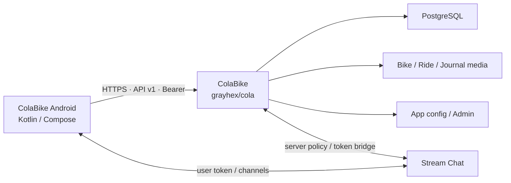

<div align="center">

# ColaBike Android

**Нативный Android-клиент велосипедного сообщества [ColaBike](https://colabike.ru)**

Android 17 · Kotlin · Jetpack Compose · Material 3 · Navigation 3 · Adaptive UI

[](https://github.com/grayhex/colabike-android/actions/workflows/ci.yml)
[](https://github.com/grayhex/colabike-android/actions/workflows/smoke.yml)
[](https://github.com/grayhex/colabike-android/actions/workflows/contract.yml)

[Сайт](https://colabike.ru) · [Основное приложение / backend](https://github.com/grayhex/cola) · [План Android](https://github.com/grayhex/colabike-android/issues/2) · [API v1](https://github.com/grayhex/cola/blob/main/docs/modules/api-v1.md) · [Issues](https://github.com/grayhex/colabike-android/issues)

</div>

---

## Что это

**ColaBike Android** — отдельный нативный клиент основного проекта [`grayhex/cola`](https://github.com/grayhex/cola).

Он не содержит собственного backend и не дублирует серверную бизнес-логику: приложение работает через версионированный **ColaBike API v1**, использует те же аккаунты, велосипеды, журнал, покатушки, уведомления и правила приватности, что и web-версия.



**Источник истины для API и доменной логики — [основной репозиторий ColaBike](https://github.com/grayhex/cola).**  
Android хранит снимок OpenAPI-контракта и еженедельно проверяет его drift относительно production.

## Состояние

Проект находится в активной **alpha-разработке**. Foundation уже собран, а основные пользовательские вертикали последовательно добавляются поверх него.

| Направление | Состояние |
| --- | --- |
| Android 17 foundation, auth/session, design system, Navigation 3 | ✅ в `main` |
| Login, guest flow, профиль и device sessions | ✅ реализовано |
| Велосипеды, личный гараж, профили, поиск, follow/like | ✅ реализовано |
| Лента, журнал, сохранённое, комментарии и ответы | ✅ реализовано |
| Покатушки, личные планы, route detail и карта | ✅ реализовано |
| Stream Chat и центр уведомлений | ✅ реализовано |
| Компоненты и барахолка | ⏳ следующий продуктовый срез |
| Создание/редактирование контента и upload | ⏳ зависит от write API |
| Remote app config из ColaBike Admin | ⏳ [#14](https://github.com/grayhex/colabike-android/issues/14) / backend [cola#338](https://github.com/grayhex/cola/issues/338) |
| Финальная alpha-приёмка и distribution | 🚧 в работе |

Актуальная очередь и зависимости поддерживаются в [issue #2](https://github.com/grayhex/colabike-android/issues/2).

## Платформа

| | |
| --- | --- |
| **Language** | Kotlin |
| **UI** | Jetpack Compose + Material 3 |
| **Navigation** | Navigation 3 |
| **Adaptive UI** | compact / medium / expanded, list-detail |
| **Target** | Android 17 · `compileSdk/targetSdk 37` |
| **Minimum** | Android 12 · `minSdk 31` |
| **Networking** | generated Kotlin client from OpenAPI + OkHttp |
| **Auth** | opaque access/refresh tokens, Android Keystore, PKCE |
| **Images** | Coil |
| **Tests** | JUnit, MockWebServer, Robolectric, Roborazzi, instrumented smoke |
| **Distribution** | RuStore later; Google Play is not a target |

Новый UI — Compose only. WebView не используется для интерфейса приложения; внешний вход открывается в системном браузере / Custom Tabs.

## Быстрый старт

Нужны **JDK 21** и Android SDK с **platform 37**.

```bash
git clone https://github.com/grayhex/colabike-android.git
cd colabike-android

# Полная проверка перед PR:
./gradlew verify

# Установить debug-сборку на подключённый телефон / эмулятор:
./gradlew :app:installDebug
```

`verify` запускает форматирование-проверку, контроль OpenAPI snapshot, Android Lint, unit- и screenshot-тесты и собирает debug APK.

Готовый APK после `assembleDebug`:

```text
app/build/outputs/apk/debug/app-debug.apk
```

Проверить подключённое устройство:

```bash
adb devices
```

Собрать без установки:

```bash
./gradlew :app:assembleDebug
```

## Production и тесты

Сейчас отдельного staging нет:

- debug и release используют **https://colabike.ru**;
- unit/UI tests и previews работают только на fake repositories / MockWebServer;
- live smoke использует отдельный тестовый аккаунт и GitHub secrets;
- автоматические destructive-записи в production запрещены.

Для включения native Yandex flow в debug-сборке:

```bash
./gradlew :app:installDebug -Pcolabike.yandexSignIn=true
```

Полная проверка App Link требует настроенного `ANDROID_CERT_SHA256` на backend и реального сертификата установленной сборки.

## Архитектура репозитория

```text
app/
  shell · Navigation 3 · screens · ViewModels

core/
  model/         domain models + repository interfaces
  network/       OpenAPI client + DTO mapping + repositories
  auth/          device session · refresh · Keystore · PKCE
  designsystem/  theme · tokens · reusable Compose components

api/
  openapi.json
  openapi.json.sha256

docs/
  architecture · ADR · design · screen/API mapping
```

Основной поток данных:

```text
Composable
   ↓ events
ViewModel
   ↓
Repository
   ↓
generated API client
   ↓
https://colabike.ru/api/v1
```

DTO generated-клиента не должны попадать прямо в UI. Экран работает с доменными моделями и неизменяемым `StateFlow<UiState>`.

## Связь с основным ColaBike

| Android | Основной проект |
| --- | --- |
| UI, локальное состояние, device auth, native integrations | Web, API v1, PostgreSQL, permissions, business rules |
| [`grayhex/colabike-android`](https://github.com/grayhex/colabike-android) | [`grayhex/cola`](https://github.com/grayhex/cola) |
| [Android roadmap](https://github.com/grayhex/colabike-android/issues/2) | [Общий roadmap](https://github.com/grayhex/cola/issues/136) |
| OpenAPI snapshot | [API v1 source](https://github.com/grayhex/cola/blob/main/docs/modules/api-v1.md) |
| Remote config consumer | [Mobile Admin / app-config #338](https://github.com/grayhex/cola/issues/338) |

Если Android-сценарию не хватает server endpoint, контракт сначала добавляется и фиксируется в **`grayhex/cola`**, а затем Android обновляет OpenAPI snapshot. Клиент не должен обходить API через legacy cookie-endpoints или придумывать несовместимую схему.

## Документация

- [**AGENTS.md**](AGENTS.md) — обязательные правила для coding agents, команды и Definition of Done.
- [**Architecture**](docs/architecture.md) — модули, navigation, auth/session lifecycle и environments.
- [**DESIGN.md**](DESIGN.md) — тема, компоненты, adaptive rules, состояния и accessibility.
- [**Twilight Stillness**](docs/design/twilight-stillness.md) — текущее визуальное направление.
- [**Screen ↔ API mapping**](docs/screen-api-mapping.md) — связь экранов и операций API.
- [**ADR 0001**](docs/adr/0001-platform-baseline.md) — platform baseline.
- [**ADR 0002**](docs/adr/0002-visual-direction-and-shell.md) — visual direction и shell.
- [**ADR 0003**](docs/adr/0003-account-guest-and-web-flows.md) — guest/account/web flows.

## Разработка агентом

Перед любой задачей агент должен прочитать `AGENTS.md`, профильную документацию и issue.

Главная проверка одна:

```bash
./gradlew verify
```

Нельзя ослаблять lint/tests, редактировать generated API source вручную, логировать credentials или вводить второй auth/network stack без отдельного ADR.

---

<div align="center">

**Ride. Build. Share. — ColaBike**

[ColaBike.ru](https://colabike.ru) · [Web & Backend](https://github.com/grayhex/cola) · [Android Roadmap](https://github.com/grayhex/colabike-android/issues/2)

</div>
