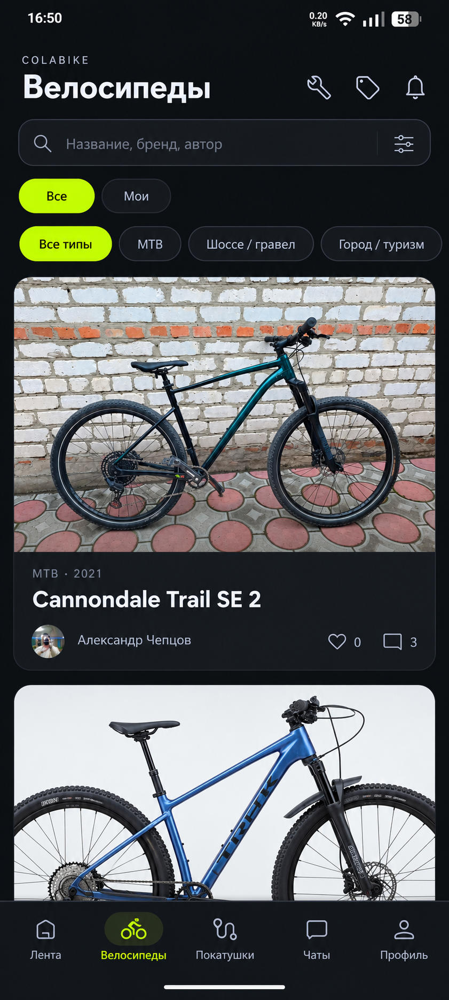
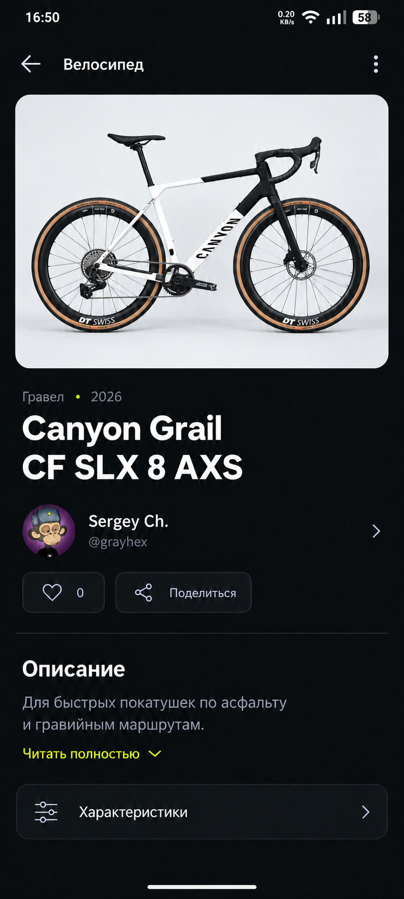
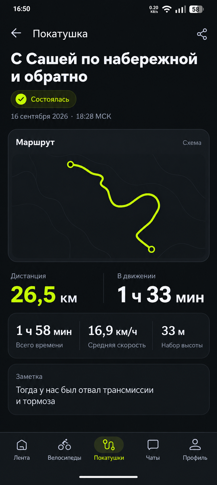
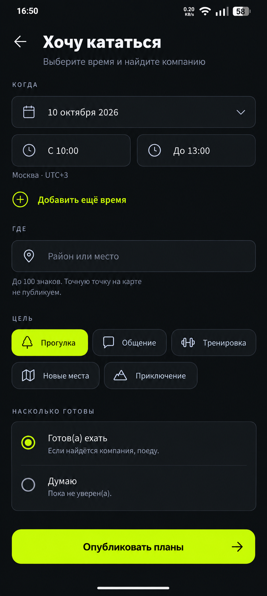
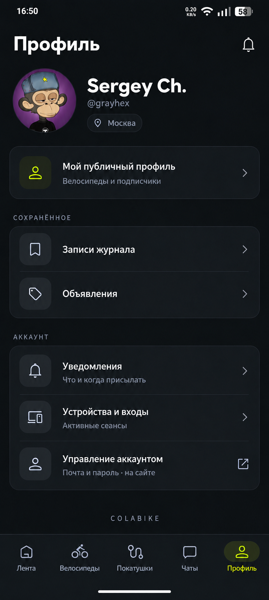

# ColaBike Android — утверждённые макеты, 06.10.2026

Пять финальных экранов, согласованных владельцем для редизайна приложения. Визуальное направление: графитовый фон, белая типографика без засечек, лаймовый акцент и компактная навигация. Исходный ориентир: https://mobile-starterkit.getdesign.md/.

## Эталоны

| Экран | Финальный файл | Уточнение владельца |
| --- | --- | --- |
| Велосипеды | [01-bicycles.png](01-bicycles.png) | Уплотнить: две полные карточки одновременно, включая обе фотографии, подписи, авторов и действия. Частично видимая вторая карточка на PNG не является целевым результатом. |
| Страница велосипеда | [02-bicycle-detail.png](02-bicycle-detail.png) | Более компактная компоновка и меньшие заголовки, чтобы раньше появлялись полезные сведения. Велосипед показывать целиком. |
| Страница покатушки | [03-ride-detail.png](03-ride-detail.png) | Более компактная компоновка и меньшие заголовки/показатели с сохранением всех данных. |
| Хочу кататься | [04-ride-intent.png](04-ride-intent.png) | Следовать макету: компактная форма и закреплённая кнопка «Опубликовать планы». |
| Профиль | [05-profile.png](05-profile.png) | Следовать макету: компактный блок личности, публичный профиль, сгруппированные настройки. |

Использованы окончательные варианты велосипеда (с запасом вокруг обоих колёс) и профиля (с тем же аватаром). Промежуточные варианты намеренно не включены.

## Приоритет требований

Текст задачи и уточнение владельца о плотности имеют приоритет над размерами элементов в PNG. Уточнение касается трёх экранов: каталога, велосипеда и покатушки; остальные визуальные решения воспроизводятся по эталонам.

Воспроизводимая проверка двух карточек: полный экран 412 × 915 dp, fontScale=1.0, обычная системная плотность, видимые системные панели, шапка, поиск, фильтры и нижняя навигация. Между карточками и над нижней навигацией оставить минимум 8 dp. Нельзя выполнять требование обрезкой фотографий, скрытием текста/кнопок, предварительной прокруткой или уменьшением системного шрифта. При увеличенном системном шрифте и необычно длинных названиях приоритет имеют читаемость и доступность; карточки растут и прокручиваются.

PNG — визуальные эталоны для нативных Compose-компонентов, а не готовые фоны приложения. Фотографии, имена, даты, показатели и состояние берутся из текущих данных приложения. Функции, появившиеся после исходных скриншотов, сохраняются и оформляются в общей системе.

## Просмотр

### 1. Велосипеды

### 2. Страница велосипеда

### 3. Покатушка

### 4. Хочу кататься

### 5. Профиль

