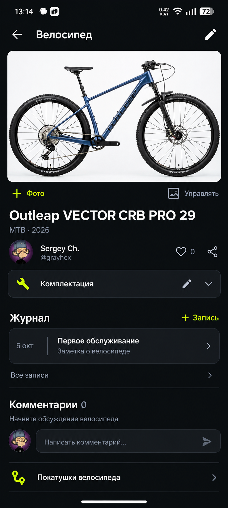
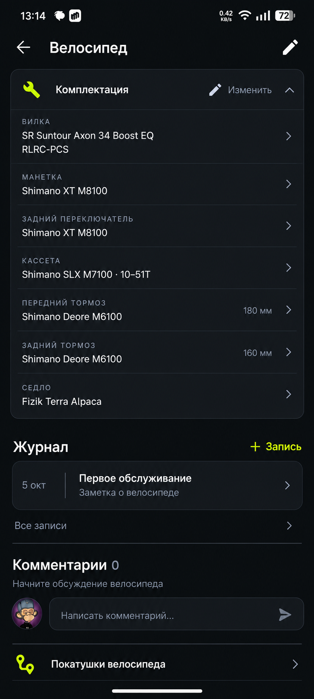
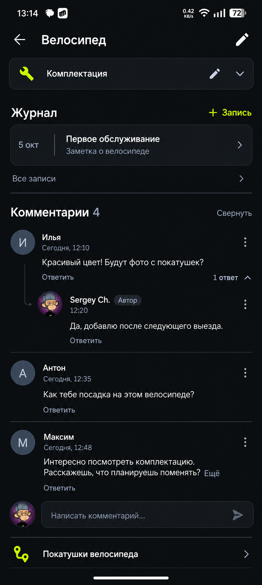

# Страница велосипеда: компактный UX

Новые макеты от 07.10.2026 для ColaBike Android. Они уточняют реализованный редизайн «графит и лайм» из [#42](https://github.com/grayhex/colabike-android/issues/42) и заменяют прежний эталон страницы велосипеда `02-bicycle-detail.png` от 06.10.2026. Остальные экраны сохраняют согласованную дизайн-систему и требования к плотности.

## Три состояния одной страницы

| Файл | Что показано |
| --- | --- |
| [01-bicycle-main.png](01-bicycle-main.png) | Основной вид владельца: фото и управление под ним, компактные сведения, закрытая комплектация, превью журнала, комментарии и переход к покатушкам. |
| [02-bicycle-equipment-expanded.png](02-bicycle-equipment-expanded.png) | Та же страница прокручена ниже, комплектация раскрыта. |
| [03-bicycle-comments-expanded.png](03-bicycle-comments-expanded.png) | Та же страница прокручена к раскрытому обсуждению с ответом. |

## Основные решения

- Одна вертикальная прокрутка. Это состояния страницы, а не три новых маршрута или вкладки.
- Фото показывается целиком. Небольшие «+ Фото» и «Управлять» находятся непосредственно под фотографией. Нажатие на сам снимок открывает полноэкранный просмотр.
- Название без повторов; тип и год — компактной строкой. Автор, реакции и шаринг занимают мало места.
- «Комплектация» закрыта при первом открытии. Раскрытие и редактирование — отдельные действия. Внутри сохраняются реальные группы, категории и порядок компонентов.
- «Журнал» показывает последнюю доступную запись и «Все записи». Справа от заголовка — небольшая «+ Запись» с уже выбранным велосипедом.
- Комментарии видны сразу: нулевое состояние либо два корневых сообщения, затем «Все комментарии». Раскрытие происходит на месте, ответы — под родителем, длинный текст — через «Ещё». «Свернуть» возвращает превью, не скрывает всё обсуждение.
- «Покатушки велосипеда» — компактный переход к состоявшимся публичным поездкам данного велосипеда.
- На compact-странице велосипеда нет нижней панели разделов. Вверху остаются «назад», название экрана и контекстные действия. Глобальная навигация и перенос чатов задаются отдельной задачей.

## Данные и права

Outleap, фотография и названия компонентов иллюстрируют пример из скриншотов владельца. «Первое обслуживание», имена участников и четыре комментария — демонстрационное наполнение. Не создавать эти записи в реальном аккаунте и не хардкодить их в приложении.

Доступ к редактированию, фото и добавлению записей остаётся у владельца. Комментарии и связанные покатушки показываются только там, где их разрешает действующий API; приватный велосипед не получает фиктивного публичного обсуждения. Сохраняются описание, паспорт, приватность, признаки бывшего велосипеда, ссылки и доступные действия, даже если их нет в демонстрационном наполнении.

PNG задают композицию, плотность и визуальную иерархию. Тексты дополнительных требований и критерии приёмки в связанной задаче имеют приоритет над демонстрационными деталями изображения. Размеры переводить в токены Compose; сохранять обе темы, системный масштаб шрифта, цели касания от 48 dp и корректные insets.

## Использование в разработке

Макеты размещены в отдельной ветке `design/bicycle-detail-ux-2026-10-07` исключительно как визуальная спецификация. Реализацию начинать с актуального `main`; при необходимости переносить только этот каталог эталонов. Код приложения в этой ветке не меняется.
